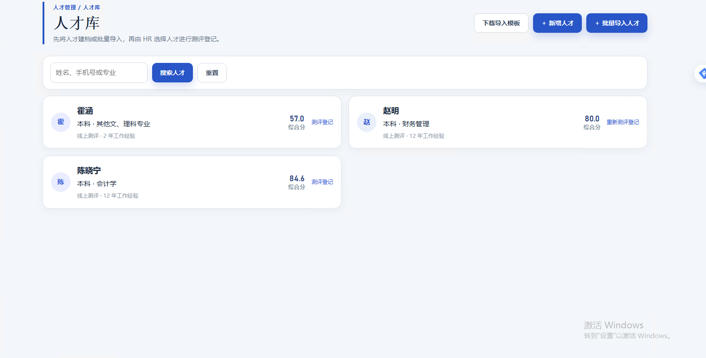
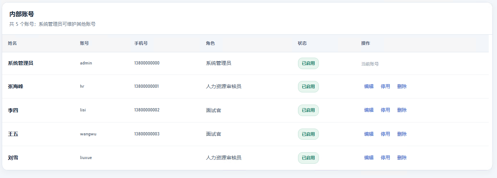
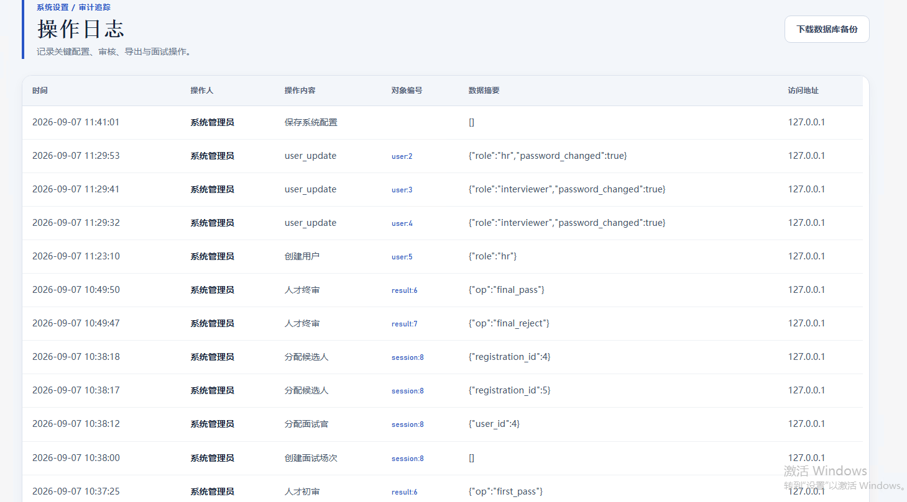
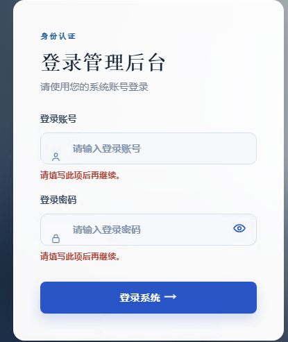

# 任职管理系统功能说明

## 1. 系统定位

任职管理系统用于统一完成岗位配置、在线测评、人才审核、面试组织、录用决策与人才沉淀。系统以岗位为核心，将基本条件、基本素质、岗位专业题及面试评分结果汇总为可追溯的人才决策档案。

## 2. 使用角色

| 角色 | 主要职责 |
| --- | --- |
| 系统管理员 | 维护系统配置、内部用户、岗位题目、测评规则及全部招聘流程数据。 |
| 人力资源审核员 | 维护岗位和题库，登记测评，审核人才，组织面试，处理人工评分及人才库。 |
| 分管领导 | 查看人才审核、人才库与面试结果，并完成审核决策。 |
| 面试官 | 通过面试场次二维码进入移动端，对被分配候选人进行一次性评分。 |
| 应聘者 | 通过应聘二维码核验身份、填写资料并提交在线测评。 |

## 3. 核心业务流程

1. HR 新建岗位并配置基本条件评分规则、基本素质题和岗位专业题。
2. 发布岗位题卷；为人才库人员批量创建测评登记。
3. 应聘者扫码填写个人资料与试题，提交后不能重复提交。
4. 系统自动计算基本条件、基本素质和岗位专业题分数，并折算为综合分。
5. HR 或分管领导在人才审核中完成初审，推荐人员进入面试。
6. HR 创建面试场次，分配面试官和符合条件的候选人。
7. 面试官扫码完成固定七维评分；全部评分提交后形成加权面试结果。
8. 完成终审录用的人才进入人才库，供后续检索与复用。

## 4. 功能模块

### 4.1 工作台

- 汇总招聘中岗位、待审核人才、面试候选人及人才库数量。
- 展示待审核人员和近期面试安排。
- 快速进入岗位创建、审核与面试管理。

### 4.2 职位管理

- 新增、编辑、启停招聘岗位。
- 维护岗位所属公司、序列、职责和应聘入口。
- 为岗位生成并管理应聘二维码入口。

### 4.3 基本题目与题库管理

- 配置基本条件评分维度与分档规则。
- 配置基本素质测评题。
- 维护岗位专业题，支持单选、多选和简答题。
- 发布题卷版本；历史版本保留题目快照，避免影响已完成答卷。

### 4.4 测评登记

- 从人才库选择一人或多人，批量登记同一测评岗位。
- 支持按姓名、手机、专业检索，并优先展示意向岗位匹配人员。
- 已录用人员不可重复登记；已答题人员不可取消或更改登记。
- 可查看登记状态、修改岗位或取消尚未开始的登记。

### 4.5 在线测评与自动计分

- 应聘者扫码后进行身份核验并填写基本资料。
- 基本条件按当前启用评分规则自动折算为 50 分。
- 基本素质题自动计分并折算为 25 分。
- 岗位专业题自动计分或进入人工评分，并最终折算为 25 分。
- 答卷提交使用防重复机制，提交成功后不能再次作答。

### 4.6 人才审核

- 查看候选人的综合分、基本条件、基本素质、专业能力和逐项明细。
- 支持初审推荐进入面试或不予推荐。
- 支持终审录用或不录用，并保留审核意见与历史记录。
- 已完成终审的人员不再出现在待审核列表。

### 4.7 面试管理

- 创建面试场次，维护岗位、日期、时间、地点和状态。
- 为场次分配面试官、权重和主面试官。
- 仅“已答题且初审推荐进入面试”的人员可以加入候选人列表。
- 已完成场次关闭扫码评分入口，不能再次评分。

### 4.8 面试评分与面试结果

- 面试官通过二维码进入移动端评分，不使用后台账号进行评分。
- 采用固定七维评分表：专业能力、相关经验、沟通、逻辑、团队协作、学习能力和职业素养。
- 单位面试官提交后可以查看本人评分，但不能修改；全部候选人完成后退出评分页。
- 系统按面试官权重汇总为 5 分制面试分，并按分数自动推导建议等级。
- 面试结果页可查看评分进度、建议等级、各面试官评价与汇总结果。

### 4.9 人才库

- 支持新增人才、编辑人才、批量导入 XLSX 文件与下载 XLSX 模板。
- 维护人才的意向职位，测评登记时可按意向岗位匹配筛选。
- 支持姓名、手机号和专业检索，以及分页浏览。
- 已面试通过人员标记“面试通过”，不可再次创建测评登记。
- 可预览人才简历与综合评分。

### 4.10 用户管理与系统设置

- 系统管理员可新增、编辑、启用、停用或删除其他内部账号。
- 编辑账号时可修改姓名、账号、手机、角色，并可选择重置密码。
- 非系统管理员只能查看账号列表并修改自己的密码。
- 系统配置可维护系统名称、机构名称及应聘/面试会话有效时间。

### 4.11 操作日志与备份

- 记录岗位、题目、测评、审核、面试、账号与配置等关键操作。
- 日志将动作、关联记录和操作说明转换为中文，便于追踪。
- 系统管理员可下载 SQLite 数据库备份。

## 5. 登录与安全说明

- 登录页默认不自动填充账号和密码。
- 登录信息为空时，页面以统一提示反馈，不会破坏移动端布局。
- 所有表单请求均带 CSRF 校验。
- 应聘者答题与面试官评分均包含状态校验，避免重复提交或已完成场次再次评分。

## 6. 评分构成

| 模块 | 折算满分 | 说明 |
| --- | ---: | --- |
| 基本条件 | 50 分 | 根据基本信息与评分规则自动匹配、自动折算。 |
| 基本素质 | 25 分 | 根据基本素质试题得分自动折算。 |
| 岗位专业题 | 25 分 | 根据岗位题目得分自动折算；简答题需人工评分后计入。 |
| 综合分 | 100 分 | 三个模块折算分之和。 |

折算规则：`折算分 = 原始得分 × 模块折算满分 ÷ 模块原始总分`。
